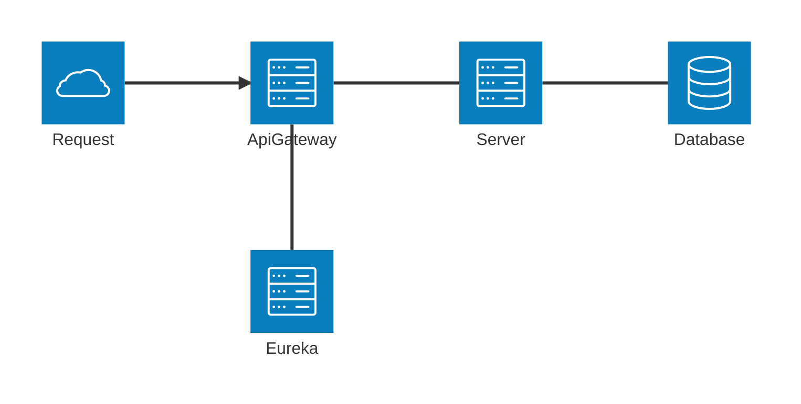

# Global architecture

```mermaid
architecture-beta
service user(cloud)[Request]
service apiGateway(server)[ApiGateway]
service eurekaServer(server)[Eureka]
service server(server)[Server]
service db(database)[Database]

user:R --> L:apiGateway
apiGateway:B -- T:eurekaServer
apiGateway:R -- L:server
server:R -- L:db
```
