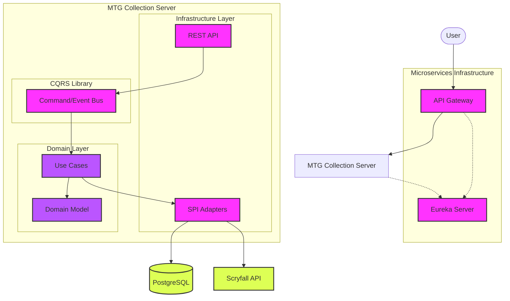

# Global architecture

```mermaid
graph TD
    User([User]) --> Gateway[API Gateway]
    
    subgraph "Microservices Infrastructure"
        Eureka[Eureka Server]
        Gateway
    end

    Gateway --> Server[MTG Collection Server]
    
    subgraph "MTG Collection Server"
        direction TB
        subgraph "Infrastructure Layer"
            API[REST API]
            SPI[SPI Adapters]
        end
        
        subgraph "Domain Layer"
            UC[Use Cases]
            Model[Domain Model]
        end
        
        subgraph "CQRS Library"
            Bus[Command/Event Bus]
        end

        API --> Bus
        Bus --> UC
        UC --> Model
        UC --> SPI
    end

    Server -.-> Eureka
    Gateway -.-> Eureka

    SPI --> DB[(PostgreSQL)]
    SPI --> Scryfall[Scryfall API]

    classDef infrastructure fill:#f3f,stroke:#333,stroke-width:2px;
    classDef domain fill:#b5f,stroke:#333,stroke-width:2px;
    classDef external fill:#df5,stroke:#333,stroke-width:2px;

    class Eureka,Gateway,API,SPI,Bus infrastructure;
    class UC,Model domain;
    class DB,Scryfall external;
```
