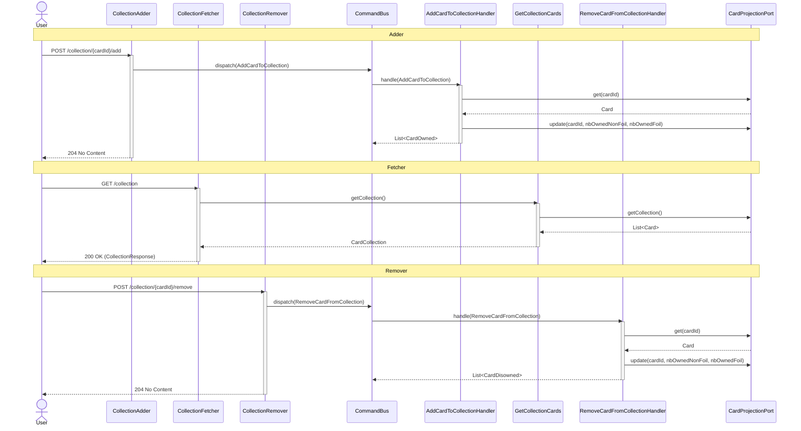

# Collection API Flow

```mermaid
sequenceDiagram
    actor User
    participant Adder as CollectionAdder
    participant Fetcher as CollectionFetcher
    participant Remover as CollectionRemover
    participant Bus as CommandBus
    participant AddHandler as AddCardToCollectionHandler
    participant GetUseCase as GetCollectionCards
    participant RemoveHandler as RemoveCardFromCollectionHandler
    participant CardProjection as CardProjectionPort

    Note over User, CardProjection: Adder

    User->>Adder: POST /collection/{cardId}/add
    activate Adder
    Adder->>Bus: dispatch(AddCardToCollection)
    Bus->>AddHandler: handle(AddCardToCollection)
    activate AddHandler
    AddHandler->>CardProjection: get(cardId)
    CardProjection-->>AddHandler: Card
    AddHandler->>CardProjection: update(cardId, nbOwnedNonFoil, nbOwnedFoil)
    AddHandler-->>Bus: List<CardOwned>
    deactivate AddHandler
    Adder-->>User: 204 No Content
    deactivate Adder

    Note over User, CardProjection: Fetcher

    User->>Fetcher: GET /collection
    activate Fetcher
    Fetcher->>GetUseCase: getCollection()
    activate GetUseCase
    GetUseCase->>CardProjection: getCollection()
    CardProjection-->>GetUseCase: List<Card>
    GetUseCase-->>Fetcher: CardCollection
    deactivate GetUseCase
    Fetcher-->>User: 200 OK (CollectionResponse)
    deactivate Fetcher

    Note over User, CardProjection: Remover

    User->>Remover: POST /collection/{cardId}/remove
    activate Remover
    Remover->>Bus: dispatch(RemoveCardFromCollection)
    Bus->>RemoveHandler: handle(RemoveCardFromCollection)
    activate RemoveHandler
    RemoveHandler->>CardProjection: get(cardId)
    CardProjection-->>RemoveHandler: Card
    RemoveHandler->>CardProjection: update(cardId, nbOwnedNonFoil, nbOwnedFoil)
    RemoveHandler-->>Bus: List<CardDisowned>
    deactivate RemoveHandler
    Remover-->>User: 204 No Content
    deactivate Remover
```
