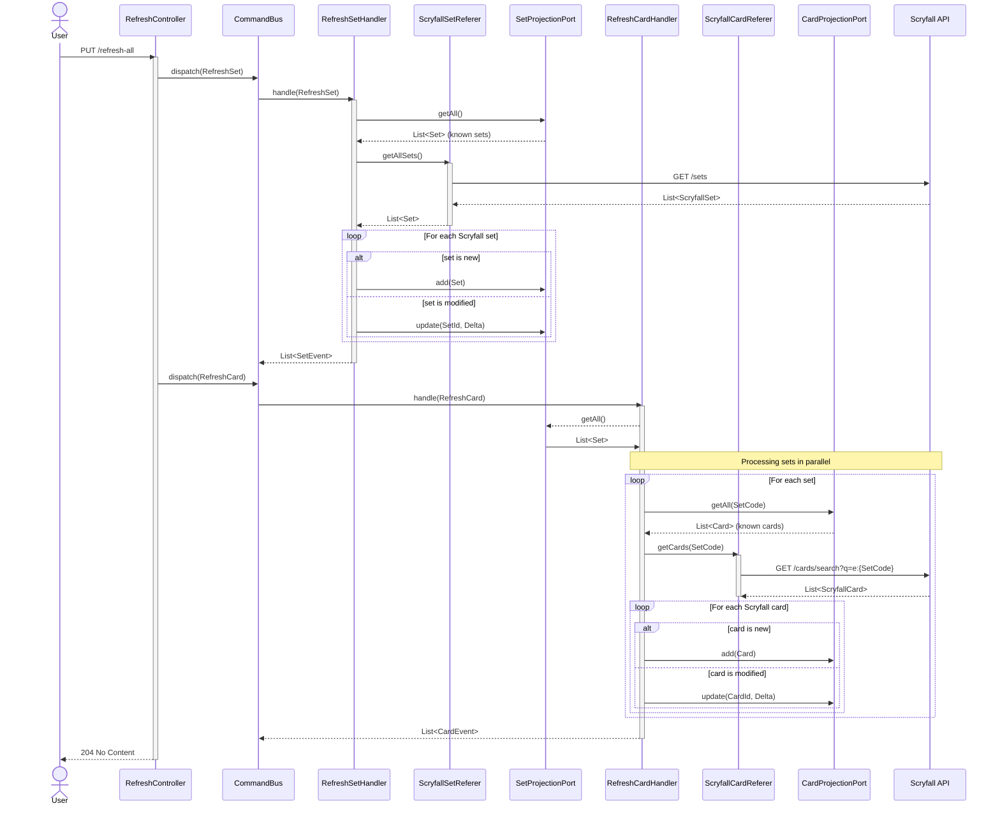

# Refresh API Flow

```mermaid
sequenceDiagram
    actor User
    participant Controller as RefreshController
    participant Bus as CommandBus
    participant SetHandler as RefreshSetHandler
    participant SetReferer as ScryfallSetReferer
    participant SetProjection as SetProjectionPort
    participant CardHandler as RefreshCardHandler
    participant CardReferer as ScryfallCardReferer
    participant CardProjection as CardProjectionPort
    participant Scryfall as Scryfall API

    User->>Controller: PUT /refresh-all
    activate Controller
    
    Controller->>Bus: dispatch(RefreshSet)
    Bus->>SetHandler: handle(RefreshSet)
    activate SetHandler
    
    SetHandler->>SetProjection: getAll()
    SetProjection-->>SetHandler: List<Set> (known sets)
    
    SetHandler->>SetReferer: getAllSets()
    activate SetReferer
    SetReferer->>Scryfall: GET /sets
    Scryfall-->>SetReferer: List<ScryfallSet>
    SetReferer-->>SetHandler: List<Set>
    deactivate SetReferer
    
    loop For each Scryfall set
        alt set is new
            SetHandler->>SetProjection: add(Set)
        else set is modified
            SetHandler->>SetProjection: update(SetId, Delta)
        end
    end
    
    SetHandler-->>Bus: List<SetEvent>
    deactivate SetHandler
    
    Controller->>Bus: dispatch(RefreshCard)
    Bus->>CardHandler: handle(RefreshCard)
    activate CardHandler
    
    CardHandler-->>SetProjection: getAll()
    SetProjection->>CardHandler: List<Set>
    
    Note over CardHandler, Scryfall: Processing sets in parallel
    
    loop For each set
        CardHandler->>CardProjection: getAll(SetCode)
        CardProjection-->>CardHandler: List<Card> (known cards)
        
        CardHandler->>CardReferer: getCards(SetCode)
        activate CardReferer
        CardReferer->>Scryfall: GET /cards/search?q=e:{SetCode}
        Scryfall-->>CardReferer: List<ScryfallCard>
        deactivate CardReferer
        
        loop For each Scryfall card
            alt card is new
                CardHandler->>CardProjection: add(Card)
            else card is modified
                CardHandler->>CardProjection: update(CardId, Delta)
            end
        end
    end
    
    CardHandler-->>Bus: List<CardEvent>
    deactivate CardHandler
    
    Controller-->>User: 204 No Content
    deactivate Controller
```
